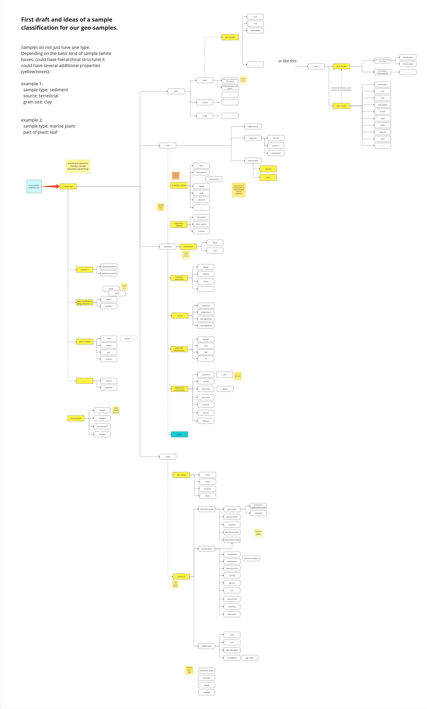

# Samples in the geoscientific community

## About the geoscientific community

The proposal comes from an interdisciplinary team from geoscience, chemistry, research software engineering and project management. Our goal is to simplify, standardize, and digitize sample management at our research center.

Our sample-related scientific backgrounds include geoscience, mineralogy, geochemistry, geology, geobiology.

## Samples in the geoscientific community

Our research community deals with the following kind of samples: rocks, sediments, soil, plants, water, ice, microbes, fungi, gas, fluids, fossils, clay, organic matter, gas hydrates, etc. (This list is not intended to be complete.)

## Characterising properties

We have created a draft for a hierarchical classification of the samples we work with. This draft was created based on an elaborate requirements engineering conducted with colleagues from different geoscientific disciplines. The mentioned draft is attached in the appendix.

To classify a sample, first a basic type should be assigned. These types are listed in a controlled vocabulary (CV) and have a clear and meaningful label and definition. The CV should be published in a common file format like [SKOS](https://www.w3.org/TR/skos-primer/) and should obey the FAIR principles.

When thinking about the basic types, we quickly find ourself wanting to build a hierarchy, rooting in the basic type “sample type” , e.g. tree → plant → biota → sample type  or  volcanic → magmatic → rock → sample type. Doing this, the CV evolves to a taxonomy (see [figure](https://raw.githubusercontent.com/rd-alliance/HarmonisedMatChemWG/refs/heads/main/semantic-onion.svg)). In the first step this is not necessary to classify a sample, but it helps later when grouping/filtering similar samples for example in a user interface.

But enforcing a tree-like structure may cause problems with terms you want to assign to several parents/topics. For example are “ice” and “water” siblings in the hierarchy or is “water” the parent (more generic type) of “ice”? We propose a more flexible approach using “broader” and “narrower” from SKOS, where a term could have several “narrower” relations (child of) to other terms.

We think samples do not have just a type. Depending on the basic kind of sample it could have several additional properties and/or a faceted classification. For example rocks and sediments could share properties like mineralogy or stratigraphy.

Following the research data lifecycle, after a sample/specimen was collected, it is typically prepared for analysis and becomes a “processed sample” (e.g. from [OBI](http://purl.obolibrary.org/obo/OBI_0000953) ontology). We also have names for those kind of samples e.g. core sample → section → section split → (sample) → powder → solution.

## Vocabularies and metadata standards

The following vocabularies and metadata standards are used within our community, or we are aware that they are used by other colleagues: (This list is not intended to be complete.)

- [IGSN](https://ev.igsn.org/)
- [SESAR](https://www.geosamples.org/vocabularies)
- [PetDB sample type](https://search.earthchem.org/setsampletype?pkey=3309273)
- [ODM2 Controlled Vocabularies](http://vocabulary.odm2.org/)
- [GeoNames](https://www.geonames.org/)
- [International Chronostratigraphic Chart](https://stratigraphy.org/chart/)
- [iDAI chronontology](https://chronontology.dainst.org/period/UBYAcNFUq2Bo)
- [NASA GCMD Keywords](https://www.earthdata.nasa.gov/data/tools/gcmd-keyword-viewer)
- [Analytical techniques for geochemistry](https://demo.vocabs.ardc.edu.au/viewById/1140)
- [COB](https://www.ebi.ac.uk/ols4/ontologies/cob), [OBI](https://www.ebi.ac.uk/ols4/ontologies/obi)

## Sample PIDs being used

IGSNs are used for samples by some working groups. ORCIDs are used for involved people like sample collector. Our institute runs its own minting service for IGSNs and IGSNs are referenced in paper/data publications if applicable.

## Authors

- Dr. Manja Luzi-Helbing, manja.luzi-helbing@gfz.de, ORCID: [0000-0002-5765-0245](https://orcid.org/0000-0002-5765-0245 "ORCID")
- Dr. Felix Mühlbauer, felix.muehlbauer@gfz.de, ORCID: [0000-0002-0727-8326](https://orcid.org/0000-0002-0727-8326)

GFZ Helmholtz Centre for Geosciences

## Appendix

